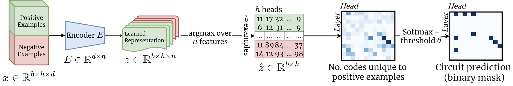
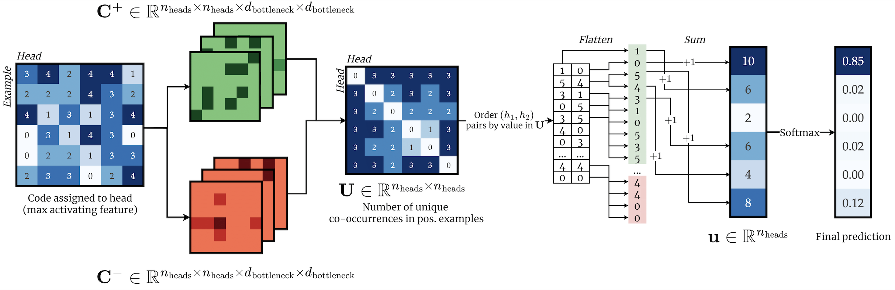

[]()

# SAE Circuits





## Setup and Installation 📦

This project uses [Poetry](https://python-poetry.org/) for dependency management. However, we have only three dependencies: `pytorch`, `transformer_lens` (see [here](https://neelnanda-io.github.io/TransformerLens/)) and `black` (for code formatting). Follow these instructions to set up your environment.

### Prerequisites

- Python 3.12
- Poetry

### Installing Poetry

If you don't already have Poetry installed, you can install it by running:

```bash
curl -sSL https://install.python-poetry.org | python3 -
```

This command will install Poetry and add it to your PATH. For more detailed instructions, visit the [Poetry installation guide](https://python-poetry.org/docs/#installation).

### Setting Up the Project

Once Poetry is installed, clone the repository and install the dependencies:

```bash
git clone https://github.com/charlieoneill11/sae-circuits.git
cd sae-circuits
poetry install
```

This will install all necessary dependencies as specified in the `pyproject.toml` file.

### Running the Project

To run the main script, use Poetry to handle the environment:

```bash
poetry run python main.py --config config.yaml
```


## Code Formatting with Black ⚫

To maintain consistent coding style and improve code readability across the project, we use [Black](https://github.com/psf/black), a highly opinionated code formatter. Follow these steps to use Black to format the Python code in this repository.

### Installing Black

If Black is not already listed as a dependency in the `pyproject.toml`, you can add it using Poetry:

```bash
poetry add --dev black
```

This command adds Black to the project's development dependencies, ensuring it does not get installed in production environments.

### Running Black

To format your project's Python files, you can run Black through Poetry to ensure it operates within the project's virtual environment:

```bash
poetry run black .
```

This command will format all Python files in your project directory (and subdirectories) according to Black's rules.

### Configuring Black

If you have specific formatting preferences that differ from Black's defaults, you can configure Black in a `pyproject.toml` file under the `[tool.black]` section. Here is an example of setting line length:

```toml
[tool.black]
line-length = 88
```

You can adjust `line-length` or add other configurations according to the [Black documentation](https://black.readthedocs.io/en/stable/usage_and_configuration/the_basics.html#configuration-via-a-file).

### Checking Formatting

Before committing your changes, you can check which files would be reformatted without actually applying the changes:

```bash
poetry run black --check .
```

This command provides a way to ensure your code meets the formatting standards before pushing it to your repository.